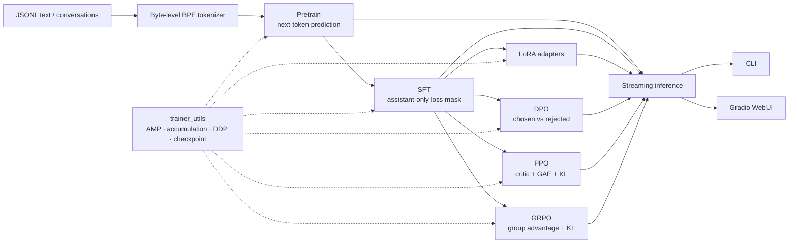
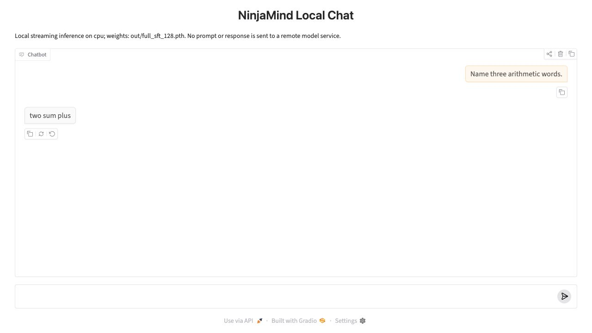
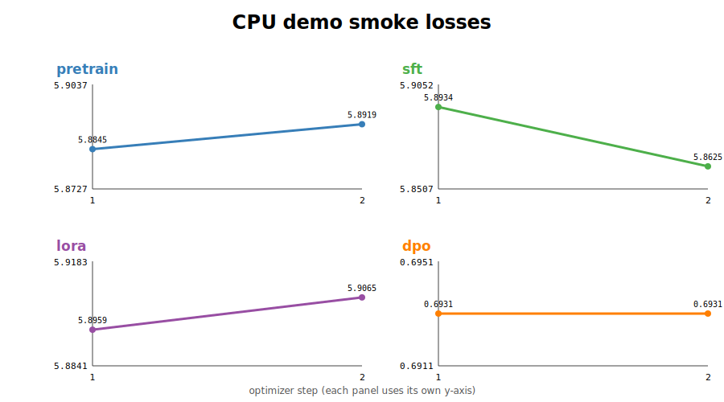
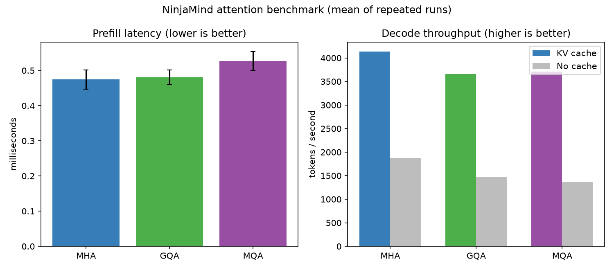

# MiniMind from Scratch（NinjaMind）

一个面向学习与 MLE 工程实践的、可测试且可复现的 Decoder-only Transformer 项目：从 Byte-level BPE、预训练、SFT/LoRA，到 DPO/PPO/GRPO、KV Cache 推理、DDP 和可复现实验，尽量用小而完整的代码串起 LLM 生命周期。

> **先说明边界：**这是教学与工程复现项目，不是已经训练好的可用大模型，也不声称发明了 Transformer、LoRA、DPO、PPO 或 GRPO。artifact 记录的 tiny 模型只训练了 2 个 optimizer step，生成结果已经退化，不能用于证明回答质量。

代码仓库：[ziyang02/minimind_from_scratch](https://github.com/ziyang02/minimind_from_scratch)

## 当前实现状态

| 能力 | 状态 | 已验证边界 |
|---|---|---|
| Decoder-only Transformer | 已实现 | RMSNorm、RoPE/可选 YaRN、MHA/GQA/MQA、SwiGLU、严格 causal mask、左 padding、Dense/MoE 均有 CPU 测试 |
| Hugging Face 接口 | 已实现 | `PreTrainedModel`、`GenerationMixin`、legacy/Dynamic/Static KV Cache，以及 HF 本地目录保存/回读 logits round-trip 已测试 |
| Tokenizer 与数据集 | 已实现 | Byte-level BPE、ChatML 风格模板、Pretrain/SFT/DPO/RLAIF/AgentRL dataset；AgentRL 目前只有 dataset，没有 trainer |
| Pretrain / SFT / LoRA / DPO | 已实现 | 仓库内 demo 数据的 2-step CPU smoke 已完成并保存真实 artifact |
| PPO / GRPO | 已实现实验版 | reference policy、KL、generated-token mask、GAE/group advantage 已测试；reward 仍是 toy containment rule |
| torchrun / DDP | 已实现 | 双进程 CPU/Gloo 已实际跑通 Pretrain、DPO、PPO、GRPO；CUDA/NCCL 与双 GPU 性能未验证 |
| 流式推理 CLI | 已实现 | 本地随机模型 smoke、base/SFT/LoRA `.pth`、本地 HF 目录、KV Cache/no-cache 路径 |
| Gradio WebUI | 已实现，本地链路已验证 | CPU 浏览器中完成一次 prompt/streamed response 并保存截图；未做部署、并发或稳定性验收 |
| 测试与 CI | 已实现 | 2026-07-22 本地 `ruff` 通过、`43 passed`；GitHub Actions 尚未在远端 runner 实际触发 |
| Attention benchmark | 已实现 | MHA/GQA/MQA + cache/no-cache 的 tiny CPU benchmark 已运行；没有 CUDA 数据 |
| 长训练与模型质量 | 未完成 | 没有 validation loss、perplexity、下游准确率或可用 checkpoint |

## Pipeline



## 模型结构

NinjaMind 是可配置的 Decoder-only causal LM。一个 block 的主路径为：

```text
token embedding
  -> RMSNorm -> causal self-attention (MHA / GQA / MQA + RoPE) -> residual
  -> RMSNorm -> SwiGLU Dense FFN 或 top-k MoE -> residual
  -> final RMSNorm -> tied LM head
```

- **RMSNorm**：低精度输入时用 FP32 计算归一化统计，再转换回输入 dtype。
- **RoPE / YaRN**：RoPE table 从 config 延迟构建，不写入 checkpoint；可选 YaRN scaling 用于长上下文实验。
- **MHA / GQA / MQA**：`num_attention_heads` 与 `num_key_value_heads` 独立配置，KV head 在 attention 内正确展开。
- **Mask 与左 padding**：严格 causal mask；position ID 从二维 attention mask 推导，使 batched 左填充与逐样本结果一致。
- **KV Cache**：支持 legacy tuple，以及 Transformers 的 Dynamic/Static cache；增量 logits 与全量重算有回归测试。
- **SwiGLU**：Dense FFN 使用 gate/up/down projection。
- **MoE**：支持 top-k expert routing、归一化 route weight 和 router auxiliary loss；top-k token/weight 配对、padding 排除和梯度均有测试。
- **Hugging Face 兼容**：继承 `PreTrainedModel` / `GenerationMixin`，支持 `generate()`、本地 `save_pretrained()` / `from_pretrained()`。

模型规模由 CLI 参数决定。实验 artifact 使用的是 27,376 参数 tiny 模型，不代表默认配置或生产配置。

## 安装与 5 分钟 CPU 快速开始

要求 Python `>=3.10`。推荐使用 [uv](https://docs.astral.sh/uv/)：

```bash
git clone https://github.com/ziyang02/minimind_from_scratch.git
cd minimind_from_scratch
uv sync --frozen --extra cpu --extra dev

# 离线 tiny 随机模型推理，不下载权重
uv run python scripts/run_model.py

# 快速测试
uv run pytest -q

# 真实 trainer 的 1-step CPU pipeline；产物写到 /tmp，不污染仓库
uv run python scripts/smoke_train.py \
  --steps 1 \
  --output-dir /tmp/minimind-smoke \
  --artifact /tmp/minimind-smoke.json
```

`cpu` 与 `cu130` 是互斥 accelerator extras：Linux CI/CPU 快速开始只解析官方 `torch+cpu` wheel；`cu130` 仅供匹配 CUDA 13.0 的未验证 GPU 环境。macOS 下 `cpu` 会回退到 PyPI 的原生 wheel。

首次安装 PyTorch 的下载时间取决于网络；安装完成后，上面的模型/测试/smoke 都可在 CPU 环境执行。没有 uv 时可使用：

```bash
python -m venv .venv
source .venv/bin/activate
python -m pip install torch --index-url https://download.pytorch.org/whl/cpu
python -m pip install -e '.[dev]'
python scripts/run_model.py
pytest -q
```

## 用 demo 数据跑完整训练链路

仓库已经包含可直接使用的 tokenizer。若想从 demo 文本重新训练一个 tokenizer，可运行：

```bash
uv run python scripts/train_tokenizer.py \
  --data_path dataset/demo/pretrain_demo.jsonl \
  --vocab_size 6400 \
  --out_dir /tmp/minimind-tokenizer
```

tiny corpus 实际能学到的词表可能小于 `6400`；后续 trainer 需要通过 `--tokenizer_dir /tmp/minimind-tokenizer` 显式使用它。以下命令使用仓库自带 `tokenizer/`，模型配置与已保存的 smoke artifact 一致。

### 1. Pretrain

```bash
uv run python trainer/train_pretrain.py \
  --data_path dataset/demo/pretrain_demo.jsonl \
  --tokenizer_dir tokenizer \
  --out_dir out/demo \
  --hidden_size 32 \
  --num_hidden_layers 1 \
  --num_attention_heads 4 \
  --num_key_value_heads 2 \
  --max_length 96 \
  --batch_size 2 \
  --max_steps 2 \
  --log_interval 1 \
  --device cpu \
  --seed 42
```

输出：`out/demo/pretrain_32.pth`。

### 2. SFT

SFT 只在 assistant response token 上计算 loss。

```bash
uv run python trainer/train_sft.py \
  --data_path dataset/demo/sft_demo.jsonl \
  --tokenizer_dir tokenizer \
  --init_from out/demo/pretrain_32.pth \
  --out_dir out/demo \
  --hidden_size 32 \
  --num_hidden_layers 1 \
  --num_attention_heads 4 \
  --num_key_value_heads 2 \
  --max_length 96 \
  --batch_size 2 \
  --max_steps 2 \
  --log_interval 1 \
  --device cpu \
  --seed 42
```

输出：`out/demo/full_sft_32.pth`。

### 3. LoRA

LoRA 默认注入 attention 的 `q_proj/k_proj/v_proj/o_proj`，冻结基座，只训练 adapter。

```bash
uv run python trainer/train_lora.py \
  --data_path dataset/demo/sft_demo.jsonl \
  --tokenizer_dir tokenizer \
  --init_from out/demo/full_sft_32.pth \
  --out_dir out/demo \
  --lora_rank 2 \
  --lora_alpha 4 \
  --hidden_size 32 \
  --num_hidden_layers 1 \
  --num_attention_heads 4 \
  --num_key_value_heads 2 \
  --max_length 96 \
  --batch_size 2 \
  --max_steps 2 \
  --log_interval 1 \
  --device cpu \
  --seed 42
```

输出：`out/demo/lora_32.pth`。adapter checkpoint 保存 rank、alpha、targets、基座路径和训练参数；代码也支持把 LoRA 合并回基座权重。

### 4. DPO

DPO 使用 trainable policy 与 frozen reference，分别计算 chosen/rejected assistant response 的 masked sequence log-prob：

```text
L_DPO = -log sigmoid(beta * ((log pi(chosen) - log pi(rejected))
                             - (log ref(chosen) - log ref(rejected))))
```

```bash
uv run python trainer/train_dpo.py \
  --data_path dataset/demo/dpo_demo.jsonl \
  --tokenizer_dir tokenizer \
  --init_from out/demo/full_sft_32.pth \
  --out_dir out/demo \
  --beta 0.1 \
  --hidden_size 32 \
  --num_hidden_layers 1 \
  --num_attention_heads 4 \
  --num_key_value_heads 2 \
  --max_length 96 \
  --batch_size 2 \
  --max_steps 2 \
  --log_interval 1 \
  --device cpu \
  --seed 42
```

输出：`out/demo/dpo_32.pth`。默认 reference 是 `--init_from` 的冻结副本，也可通过 `--reference_from` 指定另一 checkpoint。日志包含 preference accuracy、chosen/rejected implicit reward 和 margin。

### 5. PPO

PPO 包含 frozen reference、KL penalty、critic、masked GAE、clipped policy/value objective。当前 reward 只是“生成文本是否包含参考答案”的 toy rule，不是训练好的 reward model。

```bash
uv run python trainer/train_ppo.py \
  --data_path dataset/demo/rl_demo.jsonl \
  --tokenizer_dir tokenizer \
  --init_from out/demo/full_sft_32.pth \
  --out_dir out/demo \
  --hidden_size 32 \
  --num_hidden_layers 1 \
  --num_attention_heads 4 \
  --num_key_value_heads 2 \
  --max_prompt_len 64 \
  --max_new_tokens 2 \
  --batch_size 1 \
  --ppo_epochs 1 \
  --max_steps 1 \
  --log_interval 1 \
  --device cpu \
  --seed 42
```

输出：`out/demo/ppo_32.pth`。

### 6. GRPO

GRPO 不使用 critic；每个 prompt 采样一组 completion，在组内归一化 reward，并用 frozen reference 提供 token-level KL penalty。

```bash
uv run python trainer/train_grpo.py \
  --data_path dataset/demo/rl_demo.jsonl \
  --tokenizer_dir tokenizer \
  --init_from out/demo/full_sft_32.pth \
  --out_dir out/demo \
  --hidden_size 32 \
  --num_hidden_layers 1 \
  --num_attention_heads 4 \
  --num_key_value_heads 2 \
  --max_prompt_len 64 \
  --max_new_tokens 2 \
  --batch_size 1 \
  --group_size 2 \
  --update_epochs 1 \
  --max_steps 1 \
  --log_interval 1 \
  --device cpu \
  --seed 42
```

输出：`out/demo/grpo_32.pth`。

当前 tokenizer 渲染出的 RL demo prompt 均为 59 tokens，因此两个 RL 示例使用 `--max_prompt_len 64`，避免 smoke 时截掉末尾的 assistant generation header。

上述命令是代码路径 smoke，不是推荐超参数，也不能产生有用模型。若下载正式数据，请先检查磁盘空间和数据许可证：

```bash
uv run python scripts/download_dataset.py
uv run python scripts/download_dataset.py --files dpo.jsonl rlaif.jsonl
```

下载源为 [jingyaogong/minimind_dataset](https://huggingface.co/datasets/jingyaogong/minimind_dataset)。正式数据不会提交到本仓库。

## torchrun / DDP

公共 trainer 支持：process-group 初始化与清理、`DistributedSampler`、每 epoch `set_epoch()`、rank-0 日志/checkpoint、梯度累积时 `no_sync()`、尾 accumulation window 更新，以及单进程 CPU/MPS/CUDA 回退。

下面是已实际验证的双进程 CPU/Gloo 形式；显式 loopback 地址和端口也可避开某些受限环境中 `--standalone` 的 rendezvous 问题：

```bash
uv run torchrun \
  --nproc-per-node=2 \
  --master-addr=127.0.0.1 \
  --master-port=29555 \
  trainer/train_pretrain.py \
  --data_path dataset/demo/pretrain_demo.jsonl \
  --tokenizer_dir tokenizer \
  --out_dir out/ddp \
  --hidden_size 32 \
  --num_hidden_layers 1 \
  --num_attention_heads 4 \
  --num_key_value_heads 2 \
  --max_length 32 \
  --batch_size 2 \
  --max_steps 1 \
  --log_interval 1 \
  --device cpu \
  --dist-backend gloo \
  --seed 42
```

DPO 的 DDP + `no_sync` accumulation 也已按下列形态验证：

```bash
uv run torchrun \
  --nproc-per-node=2 \
  --master-addr=127.0.0.1 \
  --master-port=29556 \
  trainer/train_dpo.py \
  --data_path dataset/demo/dpo_demo.jsonl \
  --tokenizer_dir tokenizer \
  --init_from out/demo/full_sft_32.pth \
  --out_dir out/ddp \
  --hidden_size 32 \
  --num_hidden_layers 1 \
  --num_attention_heads 4 \
  --num_key_value_heads 2 \
  --max_length 64 \
  --batch_size 1 \
  --accumulation_steps 2 \
  --max_steps 1 \
  --device cpu \
  --dist-backend gloo
```

单机双 GPU/NCCL 的命令形式如下，但本项目**尚未实际验证**，不能据此声称加速收益。仓库提供的 `cu130` extra 对应 PyTorch CUDA 13.0 wheel；只应在驱动/平台匹配时使用，其他 CUDA 版本需按 PyTorch 官方说明调整 index：

```bash
uv sync --frozen --extra cu130 --extra dev
uv run torchrun \
  --nproc-per-node=2 \
  --master-addr=127.0.0.1 \
  --master-port=29557 \
  trainer/train_pretrain.py \
  --data_path dataset/demo/pretrain_demo.jsonl \
  --device cuda \
  --dist-backend nccl
```

## 流式推理 CLI

无 checkpoint 时，`scripts/run_model.py` 会创建 tiny 随机模型，只用于检查离线推理链路：

```bash
uv run python scripts/run_model.py
```

加载前面生成的 SFT checkpoint 并逐 token 累积输出：

```bash
uv run python main.py \
  --tokenizer-dir tokenizer \
  --checkpoint out/demo/full_sft_32.pth \
  --prompt 'What is 2 plus 2?' \
  --device cpu \
  --max-new-tokens 32 \
  --temperature 0 \
  --top-k 0
```

在 SFT 基座上加载 LoRA：

```bash
uv run python main.py \
  --tokenizer-dir tokenizer \
  --checkpoint out/demo/full_sft_32.pth \
  --lora-checkpoint out/demo/lora_32.pth \
  --prompt 'What is 3 plus 4?' \
  --device cpu \
  --max-new-tokens 32 \
  --temperature 0
```

- `--temperature 0` 为 greedy decoding；`--top-k 0` 不裁剪词表。
- 默认使用 KV Cache；传入 `--no-cache` 可走全量重算路径。
- 默认应用本地 chat template；`--raw-prompt` 可直接续写原始文本。
- `--checkpoint` 可接收结构化/legacy `.pth`，也可接收本地 Hugging Face model directory。

## WebUI

安装可选依赖并启动本地 Gradio 页面：

```bash
uv sync --frozen --extra cpu --extra web
uv run python webui.py \
  --tokenizer-dir tokenizer \
  --checkpoint out/demo/full_sft_32.pth \
  --device cpu \
  --max-new-tokens 64 \
  --temperature 0.8 \
  --top-k 40 \
  --server-name 127.0.0.1 \
  --server-port 7860
```

LoRA WebUI 同样增加 `--lora-checkpoint out/demo/lora_32.pth`。Gradio import 是 lazy 的，不安装 `web` extra 不影响训练和 CLI。

2026-07-22 已在本地 CPU 浏览器实际提交 `Name three arithmetic words.`，页面流式返回 `two sum plus`：



截图使用本地、未提交的 `out/full_sft_128.pth`，只证明 Gradio 与本地流式推理链路能够交互；三个词的短输出不代表模型具备算术能力或一般回答质量。

## 测试与 CI

```bash
uv sync --frozen --extra cpu --extra dev
uv run ruff check .
uv run pytest -q
uv run python scripts/run_model.py
uv run python scripts/smoke_train.py \
  --output-dir /tmp/minimind-smoke \
  --artifact /tmp/smoke_train.json
```

2026-07-22 在当前工作区的最新本地结果：

```text
ruff check .                 All checks passed!
pytest -q                    43 passed in 2.10s
python scripts/run_model.py  smoke inference OK
```

测试覆盖 RMSNorm、causal/left-padding mask、GQA、legacy/Dynamic/Static KV Cache、HF directory round-trip、Dense/MoE 与 padding-aware router loss、SFT response-preserving truncation、DPO shared-prompt truncation/mask、RL 左截断、LoRA 保存/加载/合并、DPO loss 与 DDP 全局 metric reduction、PPO GAE/generated mask/reward、GRPO advantage、DDP 参数/单进程回退、尾 batch/尾 accumulation、checkpoint 兼容、Unicode token streaming 和推理采样。

`.github/workflows/ci.yml` 会在 push/PR 上执行安装、ruff、pytest、CPU inference smoke 和 training pipeline smoke；该 workflow 文件已创建，但当前尚无远端 runner 成功记录，因此不能把本地通过等同于 CI 已通过。

## 可复现实验与真实结果

### 2-step CPU training smoke

来源：[smoke_train.json](artifacts/smoke_train.json) · [loss curve](artifacts/smoke_loss.svg) · [generation samples](artifacts/generation_samples.json)

环境：Python 3.12.7、PyTorch 2.12.1、macOS 15.7.4 arm64、CPU、seed 42；模型为 hidden size 32、1 layer、4 query heads、2 KV heads、vocab 372，共 27,376 参数。

| Stage | Step 1 loss | Step 2 loss | 实测阶段耗时 |
|---|---:|---:|---:|
| Pretrain | 5.8845 | 5.8919 | 2.8703 s |
| SFT | 5.8934 | 5.8625 | 3.2447 s |
| LoRA | 5.8959 | 5.9065 | 4.3463 s |
| DPO | 0.6931 | 0.6931 | 2.8307 s |



这些数值只证明真实 trainer、数据、反向传播、optimizer 和 checkpoint 路径可执行。两点 loss 不能说明收敛，也不能跨 stage 比较；DPO 第二步 preference accuracy 为 `0.500`，但 margin 约为 `-0.0000`，在 4 条 preference demo 上没有统计意义。

**生成质量警告：**`generation_samples.json` 中三个 prompt 的 greedy completion 都是连续 12 个换行（可记为 `\n × 12`）。这是仅训练 2 step 的 tiny 模型发生退化的真实结果，不是有效问答样例。smoke checkpoint 未提交，且交接清理后原 `out/smoke_final/` 已删除；需要使用 `scripts/smoke_train.py` 重新生成。

artifact 的 `git_commit` 是 `9c9f940241da73fe5f4eb06f5b9bd54ca3aed519`，同时明确记录 `git_dirty: true`，因此它代表当时的本地工作区快照，而不是不可变的发布版本。

### MHA / GQA / MQA + KV Cache benchmark

复现命令：

```bash
uv sync --frozen --extra cpu --extra benchmark
uv run python scripts/benchmark_attention.py --output-dir /tmp/minimind-benchmark
```

当前保存的 artifact 来源：[benchmark.json](artifacts/benchmark.json) · [benchmark.csv](artifacts/benchmark.csv) · [benchmark.png](artifacts/benchmark.png)

环境：Python 3.12.7、PyTorch 2.12.1、macOS arm64 CPU、float32、1 thread、seed 42；5 repeats、1 warmup、每个 prefill sample 20 iterations、batch 1、prompt length 128、decode 32、hidden size 64、1 layer、4 query heads。表中为 artifact 记录的 mean ± sample std：

| Attention | KV heads | Params | Prefill latency (ms) | Cached decode (tok/s) | No-cache decode (tok/s) | KV payload (B) | Cache speedup |
|---|---:|---:|---:|---:|---:|---:|---:|
| MHA | 4 | 82,144 | 0.4745 ± 0.0276 | 4,133.18 ± 176.40 | 1,879.17 ± 88.02 | 81,920 | 2.1995x |
| GQA | 2 | 78,048 | 0.4803 ± 0.0210 | 3,660.56 ± 341.43 | 1,478.85 ± 184.12 | 40,960 | 2.4753x |
| MQA | 1 | 76,000 | 0.5271 ± 0.0264 | 3,713.70 ± 498.50 | 1,360.27 ± 222.44 | 20,480 | 2.7301x |

表格只做显示精度的四舍五入；每次 repeat 的样本和完整浮点值均保留在 `benchmark.json` / `benchmark.csv`。



在三个配置中，理论 KV bytes 与实际返回 K/V tensor payload 逐项一致；相对 MHA，GQA 为一半、MQA 为四分之一。这个 tiny CPU workload 中 cache 比 no-cache 快约 2.20–2.73 倍，但 GQA/MQA 的 prefill 或 cached decode 并没有稳定快于 MHA。结果不应外推到其他硬件、batch、序列长度或 CUDA kernel。`cuda_peak_allocated_bytes` 为 `null`，因为 CUDA 未运行。

## 数据格式

所有数据均为一行一个 JSON object 的 JSONL。

Pretrain：

```json
{"text": "zero plus zero equals zero."}
```

SFT：

```json
{"conversations": [{"role": "user", "content": "What is 2 plus 2?"}, {"role": "assistant", "content": "2 plus 2 equals 4."}]}
```

DPO：

```json
{"chosen": [{"role": "user", "content": "What is 2 plus 2?"}, {"role": "assistant", "content": "2 plus 2 equals 4."}], "rejected": [{"role": "user", "content": "What is 2 plus 2?"}, {"role": "assistant", "content": "2 plus 2 equals 5."}]}
```

PPO / GRPO 使用的 RLAIF prompt：

```json
{"conversations": [{"role": "user", "content": "What is 2 plus 2?"}], "answer": "4"}
```

AgentRL dataset 还接受 `tools`、可选 `answer` 与 `gold_tool_calls`，但当前没有 AgentRL trainer。

| Demo file | 样本数 | 用途 |
|---|---:|---|
| `dataset/demo/pretrain_demo.jsonl` | 300 | Pretrain |
| `dataset/demo/sft_demo.jsonl` | 100 | SFT / LoRA |
| `dataset/demo/dpo_demo.jsonl` | 4 | DPO |
| `dataset/demo/rl_demo.jsonl` | 100 | PPO / GRPO |

SFT/DPO 的 loss mask 只覆盖 assistant response；过长 SFT 会从左侧保留最新回复，DPO 会对 chosen/rejected 使用同一份截断后的共享 prompt。RL collate 使用左截断/左 padding，并为实际 generated token（包含 EOS、排除 EOS 后 padding）建立 mask。

## Checkpoint 约定

- Full-model checkpoint 名称为 `{stage}_{hidden_size}[_moe].pth`，例如 `pretrain_32.pth`、`full_sft_32.pth`、`dpo_32.pth`。
- 新格式包含 `format_version`、`model_state_dict`、model config、tokenizer metadata、training args、stage/step；需要时还包含 optimizer state 和 reference checkpoint 信息。
- `load_weights()` 与推理 loader 兼容旧的裸 `state_dict`；历史 raw checkpoint 无完整 config 时，可能需要显式传入正确的 attention head 参数。
- LoRA checkpoint 只保存 adapter tensor，并附带 rank/alpha/targets 与基座 metadata；加载时必须同时提供 base/SFT checkpoint。
- 本地 Hugging Face directory 也可用于推理，RoPE derived buffer 会在首次 forward 重建。
- `out/` 已加入 `.gitignore`。不要提交正式模型权重、optimizer checkpoint、大数据集、API key 或 `.env`。

## 目录结构

```text
minimind_from_scratch/
├── model/
│   ├── model.py                 # Transformer、attention/cache、Dense/MoE
│   └── model_lora.py            # LoRA 注入、保存/加载、merge
├── dataset/
│   ├── lm_dataset.py            # 各阶段 dataset 与 mask/collate
│   └── demo/                    # 可提交的小型 JSONL
├── trainer/
│   ├── trainer_utils.py         # AMP、DDP、累积、checkpoint、GAE
│   ├── train_pretrain.py
│   ├── train_sft.py
│   ├── train_lora.py
│   ├── train_dpo.py
│   ├── train_ppo.py
│   └── train_grpo.py
├── inference.py                 # 可复用流式推理
├── main.py                      # CLI entry point
├── webui.py                     # 可选 Gradio UI
├── scripts/
│   ├── train_tokenizer.py
│   ├── download_dataset.py
│   ├── run_model.py
│   ├── smoke_train.py
│   └── benchmark_attention.py
├── tests/                       # CPU unit/regression tests
├── artifacts/                   # JSON/CSV/PNG/SVG 真实小实验产物
└── .github/workflows/ci.yml
```

## 已知限制

1. **没有可用模型质量。** 当前无长训练、validation/perplexity/accuracy；2-step 模型生成连续换行，不能用作 demo 回答能力。
2. **PPO/GRPO reward 是 toy rule。** 它只检查参考答案是否出现在 completion 中，不等同于 learned reward model、AI judge 或生产 RLHF/RLAIF。
3. **GPU 未验证。** 只验证了单进程 CPU 和双进程 CPU/Gloo；CUDA AMP、NCCL、双 GPU correctness/吞吐/显存均待验证。
4. **WebUI 只做了最小本地浏览器验证。** 没有并发、长会话、错误恢复、部署或鉴权测试；截图中的短输出不能作为模型质量证据。
5. **CI 尚无远端记录。** workflow 已存在，但目前只能报告本地 lint/test/smoke 结果。
6. **Benchmark 很小且依赖机器。** 只能说明当前 CPU workload；不能声称 GQA/MQA 普遍更快或给出 GPU 显存收益。
7. **AgentRL 不完整。** 有 dataset schema，没有对应 trainer、environment 或 tool executor。
8. **Artifact 来自 dirty worktree。** JSON 保留 commit/environment，但不是已发布 tag 的结果；正式报告应在 clean commit 上重跑。
9. **仓库当前没有 LICENSE 文件。** 对外发布或复用前应补齐本仓库许可证，并分别核对上游代码与数据许可。

## 参考、归属与致谢

本项目参考 [jingyaogong/minimind](https://github.com/jingyaogong/minimind) 的“小型语言模型全流程”方向、训练阶段命名和公开数据格式，并使用其 [MiniMind dataset](https://huggingface.co/datasets/jingyaogong/minimind_dataset) 作为正式数据下载源；感谢原项目作者和贡献者。

本仓库是在自身 git 历史上迭代的个人学习/工程实现，没有复制外部仓库覆盖代码。个人实现与本轮工程化范围包括：Transformer/cache/mask/MoE 修复，LoRA/DPO/PPO/GRPO trainer，DDP 与 checkpoint 设施，数据 mask，流式 CLI/WebUI，CPU 测试、smoke pipeline 和 attention benchmark。底层算法均来自公开研究与社区实践，本项目不主张算法原创性，也不隶属于或代表原 MiniMind 项目。
