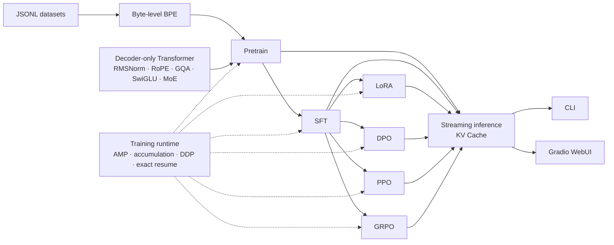

# NinjaMind — MiniMind from Scratch

[](https://github.com/ziyang02/minimind_from_scratch/actions/workflows/ci.yml?query=branch%3Amaster)
[](pyproject.toml)
[](pyproject.toml)
[](LICENSE)

一个从 Tokenizer、Decoder-only Transformer 到 Pretrain、SFT、LoRA、DPO、PPO、GRPO、分布式训练和流式推理的端到端 LLM 工程项目。

项目重点不是训练一个可直接使用的大模型，而是用可测试、可复现的代码实现完整训练系统，并处理真实 MLE 工程中的数据泄漏、全局梯度归一化、断点续训、KV Cache、DDP 和实验追踪问题。

**Tech Stack:** Python · PyTorch · Hugging Face Transformers · Tokenizers · torch.distributed · pytest · Ruff · GitHub Actions · Gradio · uv

## 项目亮点

- **完整 LLM 生命周期**：实现 Byte-level BPE、Decoder-only Transformer、Pretrain、SFT、LoRA、DPO、PPO、GRPO、CLI 和 Gradio WebUI。
- **模型核心组件**：RMSNorm、RoPE/YaRN、MHA/GQA/MQA、SwiGLU、Dense/MoE、严格 causal mask、左 padding 和 tied LM head。
- **训练可靠性**：实现 token-weighted 梯度、AMP、梯度累积、cosine LR、原子 checkpoint、best/latest 模型和单进程/DDP 精确断点续训。
- **数据与评估**：按训练后的真实 tensor 去重；用 SHA-256 做确定性分组切分，避免同 prompt 的不同回答跨 train/validation 泄漏。
- **分布式训练**：支持 `torchrun`、DDP、`DistributedSampler`、`no_sync()`、跨 rank 指标归并和 rank-0 artifact/checkpoint。
- **推理工程**：兼容 legacy、Dynamic 和 Static KV Cache；支持本地 `.pth`、LoRA adapter 和 Hugging Face directory。
- **工程质量**：84 项 CPU 单元/回归测试、Ruff、GitHub Actions、真实训练 smoke、双进程 CPU/Gloo 验证和可复现实验 artifact。

## 可量化结果

| 指标 | 结果 | 说明 |
|---|---:|---|
| 自动化测试 | **84 passed, 1 skipped** | 唯一 skip 为当前机器无 CUDA |
| 训练阶段 | **6** | Pretrain、SFT、LoRA、DPO、PPO、GRPO |
| CPU DDP | **2 processes** | Pretrain、DPO、PPO、GRPO 已用 Gloo 实跑 |
| DDP fault recovery | **exact match** | step 2 中断恢复后，step 4 模型/optimizer/scaler/逐 rank RNG 与连续训练一致 |
| KV Cache decode 加速 | **2.20–2.73×** | tiny CPU benchmark，cache 对比 no-cache |
| MQA KV payload | **减少 75%** | 相对 MHA：81,920 B → 20,480 B |
| CPU convergence pilot | **490,752 params** | 50 epochs Pretrain + 100 epochs SFT |
| Held-out generation EM | **6/10** | synthetic demo validation，仅用于验证评估闭环 |

完整证据：

- [CPU convergence pilot](artifacts/cpu_pilot.json)
- [DDP fault-recovery verification](artifacts/ddp_resume.json)
- [Attention benchmark JSON](artifacts/benchmark.json) / [CSV](artifacts/benchmark.csv)
- [Training smoke artifact](artifacts/smoke_train.json)
- [GitHub Actions workflow](.github/workflows/ci.yml)

## 系统架构


```mermaid
flowchart LR
    DATA["JSONL datasets"] --> TOK["Byte-level BPE"]
    TOK --> PT["Pretrain"]
    PT --> SFT["SFT"]
    SFT --> LORA["LoRA"]
    SFT --> DPO["DPO"]
    SFT --> PPO["PPO"]
    SFT --> GRPO["GRPO"]

    CORE["Decoder-only Transformer<br/>RMSNorm · RoPE · GQA · SwiGLU · MoE"] --> PT
    TRAIN["Training runtime<br/>AMP · accumulation · DDP · exact resume"] -.-> PT
    TRAIN -.-> SFT
    TRAIN -.-> LORA
    TRAIN -.-> DPO
    TRAIN -.-> PPO
    TRAIN -.-> GRPO

    PT --> INF["Streaming inference<br/>KV Cache"]
    SFT --> INF
    LORA --> INF
    DPO --> INF
    PPO --> INF
    GRPO --> INF
    INF --> CLI["CLI"]
    INF --> WEB["Gradio WebUI"]
```

一个 Transformer block 的主路径：

```text
token embedding
  → RMSNorm
  → causal self-attention (MHA / GQA / MQA + RoPE)
  → residual
  → RMSNorm
  → SwiGLU Dense FFN or top-k MoE
  → residual
  → final RMSNorm
  → tied LM head
```

## 关键工程设计

### 1. 数据切分与防泄漏

Pretrain、SFT 和 LoRA 在切分前会按模型实际消费的 post-template、post-truncation tensor 精确去重。SFT 进一步按“隐藏 assistant 内容后的对话骨架”分组，确保相同 prompt 的替代回答不会分别进入训练集和验证集。

- SHA-256 + seed 确定性切分，不依赖 JSONL 行顺序或全局 RNG。
- validation fraction 按完整 group 选择最接近的比例。
- demo 实测：Pretrain `300 raw → 185 unique → 167 train / 18 validation`；SFT `100 → 90 / 10`。
- checkpoint 保存 split fingerprint，resume 时严格校验。

### 2. Token-weighted 训练与验证

损失和梯度按有效 target token 全局归一化，而不是简单平均 batch loss。DDP 下会归并所有 rank 的 token count，再修正 DDP 已平均的梯度，因此不同 rank、不同 padding 比例和尾 batch 不会改变优化目标。

Validation 输出：

- token-weighted cross-entropy；
- perplexity；
- JSON / CSV / SVG 训练曲线；
- best/latest checkpoint；
- held-out SFT greedy generation exact match。

### 3. 精确断点续训

Pretrain、SFT 和 LoRA 的单进程/DDP checkpoint 保存：

- model、AdamW 和 AMP scaler state；
- epoch、batch 和 optimizer-step cursor；
- planned LR horizon；
- 每个 rank 独立的 Python、CPU，以及可用时的 CUDA/MPS RNG；
- 每个 rank 的 in-epoch loss/token 累计与 batch cursor；
- model config、tokenizer fingerprint、split 和训练参数。

恢复时使用 `strict=True` 并校验完整 run identity 与 world size。故障注入回归会让两个 Gloo rank 在 optimizer step 2 保存后退出，再恢复到 step 4；最终模型、optimizer、scaler 和两条不同的 rank-local RNG 流与连续训练逐项一致。

### 4. Attention 与 KV Cache

模型独立配置 query heads 和 KV heads，统一支持 MHA、GQA 和 MQA。推理同时覆盖 legacy tuple、Transformers Dynamic Cache 和 Static Cache，增量 logits 与全量重算有一致性测试。


在保存的 tiny CPU workload 中：

| Attention | KV heads | Cached decode | No-cache decode | KV payload | Cache speedup |
|---|---:|---:|---:|---:|---:|
| MHA | 4 | 4,133 tok/s | 1,879 tok/s | 81,920 B | 2.20× |
| GQA | 2 | 3,661 tok/s | 1,479 tok/s | 40,960 B | 2.48× |
| MQA | 1 | 3,714 tok/s | 1,360 tok/s | 20,480 B | 2.73× |

这些结果用于验证实现和相对 KV payload，不外推为 GPU 或生产性能。

## 快速开始

要求 Python `>=3.10`，推荐使用 [uv](https://docs.astral.sh/uv/)。

第一次接触命令行、只想下载四个训练结果并在聊天页面体验，请直接阅读
[给朋友的零基础体验指南](FRIEND_QUICKSTART.md)。

```bash
git clone https://github.com/ziyang02/minimind_from_scratch.git
cd minimind_from_scratch
uv sync --frozen --extra cpu --extra dev

# 离线 tiny 模型推理
uv run python scripts/run_model.py

# 测试与静态检查
uv run pytest -q
uv run ruff check .

# Pretrain → SFT → LoRA → DPO 真实训练 smoke
uv run python scripts/smoke_train.py \
  --steps 1 \
  --output-dir /tmp/minimind-smoke \
  --artifact /tmp/minimind-smoke.json
```

## 用官方数据训练 MiniMind-3 Zero

仓库自带的 `tokenizer/` 只用于离线 tiny 测试（372 tokens），不能用于正式中文训练。
正式配方会单独下载 MiniMind-3 的 **6400-token 官方 tokenizer**，并采用官方 Dense
结构：`hidden_size=768`、`8 layers`、`8 query heads / 4 KV heads`。

先用 mini 数据完成一次 Pretrain → SFT 闭环：

```bash
# 约 2.8 GB 数据；同时下载 tokenizer_minimind3/
uv run python scripts/download_dataset.py

# 默认 1 epoch；对应官网约两小时的单张 RTX 3090 配方
bash scripts/train_minimind3.sh

# CLI 对话
uv run ninjamind \
  --checkpoint out/minimind3/full_sft_768.pth \
  --tokenizer-dir tokenizer_minimind3
```

如果已经解压发布页提供的四模型展示包，可一条命令启动本地对比页面：

```bash
uv run python webui.py --showcase --device cpu
```

显存不足时降低 micro-batch、增加梯度累积：

```bash
PRETRAIN_BATCH=8 SFT_BATCH=4 PRETRAIN_ACCUMULATION=16 \
  bash scripts/train_minimind3.sh
```

多卡单机可设置 `NPROC_PER_NODE=GPU数量`，脚本会自动改用 `torchrun`。
若云镜像已经预装兼容的 PyTorch，可先执行 `python -m pip install -e .`，再通过
`USE_SYSTEM_PYTHON=1 bash scripts/train_minimind3.sh` 直接复用镜像环境。

从同一个 SFT checkpoint 分叉比较 DPO、PPO 和 GRPO：

```bash
# 官方偏好数据约 54 MB；已有 tokenizer 时无需重复下载
uv run python scripts/download_dataset.py \
  --files dpo.jsonl \
  --skip_tokenizer \
  --mirror

# 默认是单卡有界实验：DPO 1000、PPO 300、GRPO 300 optimizer steps
USE_SYSTEM_PYTHON=1 bash scripts/train_post_rl.sh
```

三个分支分别从 `out/minimind3/full_sft_768.pth` 初始化，绝不串行继承彼此权重，输出到
`out/post_training/{dpo,ppo,grpo}/`。PPO/GRPO 默认从 DPO `chosen` 构造 2000 个 rollout
prompt，并用字符 unigram/bigram overlap F1 提供连续参考奖励。这比 exact-match 更适合弱小
模型避免全零奖励，但仍属于可复现实验奖励，不等同于官网采用的独立 Reward Model。
步数和样本量可通过 `DPO_STEPS`、`PPO_STEPS`、`GRPO_STEPS`、`RL_SAMPLES` 覆盖。

完整数据（约 24 GB）使用：

```bash
uv run python scripts/download_dataset.py --full
DATA_VARIANT=full bash scripts/train_minimind3.sh
```

正式配方使用 `--split_strategy full --validation_fraction 0`，因为官方数据已经过清洗去重，
可跳过昂贵的逐样本 tensor 去重。数据文件仍会做 SHA-256 指纹并写进 checkpoint，保证严格
resume 不会误接到被替换的数据。通用能力应另用独立 benchmark/人工题集评估，不能用训练集
loss 代替效果结论。

`cpu` 和 `cu130` 是互斥 extras。Linux CPU 环境使用官方 PyTorch CPU wheel；`cu130` 仅用于驱动和平台匹配的 CUDA 13.0 环境。

## 训练入口

| Stage | Entry point | 核心实现 | 精确 resume |
|---|---|---|---|
| Pretrain | `trainer/train_pretrain.py` | next-token prediction、全 token loss | 单进程/DDP |
| SFT | `trainer/train_sft.py` | assistant-only loss mask | 单进程/DDP |
| LoRA | `trainer/train_lora.py` | attention adapter、冻结基座、merge | 单进程/DDP |
| DPO | `trainer/train_dpo.py` | frozen reference、chosen/rejected log-prob | 暂不支持 |
| PPO | `trainer/train_ppo.py` | critic、GAE、KL、clipped objective | 暂不支持 |
| GRPO | `trainer/train_grpo.py` | group reward normalization、token KL | 暂不支持 |

### Pretrain

```bash
uv run python trainer/train_pretrain.py \
  --data_path dataset/demo/pretrain_demo.jsonl \
  --tokenizer_dir tokenizer \
  --out_dir out/demo \
  --hidden_size 128 \
  --num_hidden_layers 2 \
  --num_attention_heads 4 \
  --num_key_value_heads 2 \
  --max_length 96 \
  --epochs 10 \
  --batch_size 16 \
  --save_interval 50 \
  --device cpu \
  --seed 42
```

输出：

```text
out/demo/pretrain_128.pth          # latest + resumable
out/demo/pretrain_128_best.pth     # compact best validation
out/demo/metrics/pretrain_metrics.json
out/demo/metrics/pretrain_metrics.csv
out/demo/metrics/pretrain_ce.svg
```

### SFT 与生成评估

```bash
uv run python trainer/train_sft.py \
  --data_path dataset/demo/sft_demo.jsonl \
  --tokenizer_dir tokenizer \
  --init_from out/demo/pretrain_128_best.pth \
  --out_dir out/demo \
  --hidden_size 128 \
  --num_hidden_layers 2 \
  --num_attention_heads 4 \
  --num_key_value_heads 2 \
  --max_length 96 \
  --epochs 10 \
  --batch_size 16 \
  --device cpu \
  --seed 42

uv run python scripts/evaluate_sft.py \
  --checkpoint out/demo/full_sft_128_best.pth \
  --tokenizer-dir tokenizer \
  --data dataset/demo/sft_demo.jsonl \
  --max-length 96 \
  --validation-fraction 0.1 \
  --split-seed 42 \
  --device cpu \
  --max-new-tokens 64 \
  --output out/demo/metrics/sft_generation_evaluation.json
```

评估必须复用训练时的数据、tokenizer、`max_length`、validation fraction 和 split seed。

### 断点续训

`--init_from` 只加载权重并开始新训练阶段；`--resume` 严格恢复同一次运行。

```bash
uv run python trainer/train_pretrain.py \
  --data_path dataset/demo/pretrain_demo.jsonl \
  --out_dir out/demo \
  --hidden_size 128 \
  --num_hidden_layers 2 \
  --num_attention_heads 4 \
  --num_key_value_heads 2 \
  --max_length 96 \
  --epochs 10 \
  --batch_size 16 \
  --save_interval 50 \
  --device cpu \
  --seed 42 \
  --resume out/demo/pretrain_128.pth
```

除 `--resume` 外，模型、数据、切分、batch、LR、seed、epochs 和其他训练参数必须与原运行一致。

### 双进程 CPU DDP

```bash
uv run torchrun \
  --nproc-per-node=2 \
  --master-addr=127.0.0.1 \
  --master-port=29555 \
  trainer/train_pretrain.py \
  --data_path dataset/demo/pretrain_demo.jsonl \
  --tokenizer_dir tokenizer \
  --out_dir out/ddp \
  --hidden_size 32 \
  --num_hidden_layers 1 \
  --num_attention_heads 4 \
  --num_key_value_heads 2 \
  --max_length 32 \
  --batch_size 2 \
  --max_steps 1 \
  --device cpu \
  --dist-backend gloo \
  --seed 42
```

Pretrain、SFT 和 LoRA 支持使用相同 world size 做 DDP 精确恢复。checkpoint 保存每个 rank 独立的 RNG 与局部训练状态；`scripts/verify_ddp_resume.py` 提供可复现的双进程故障注入验证。

## 推理与 WebUI

CLI 支持 greedy/sampling、KV Cache/no-cache、ChatML/raw prompt，以及 full-model、LoRA 和本地 Hugging Face checkpoint。

```bash
uv run python main.py \
  --tokenizer-dir tokenizer \
  --checkpoint out/demo/full_sft_128_best.pth \
  --prompt "What is 2 plus 2?" \
  --device cpu \
  --max-new-tokens 32 \
  --temperature 0
```

启动 Gradio：

```bash
uv sync --frozen --extra cpu --extra web
uv run python webui.py \
  --tokenizer-dir tokenizer \
  --checkpoint out/demo/full_sft_128_best.pth \
  --device cpu \
  --server-name 127.0.0.1 \
  --server-port 7860
```


WebUI 截图用于证明本地交互和流式推理链路，不代表模型回答质量。

## 测试与 CI

```text
ruff check .                 All checks passed
pytest -q                    84 passed, 1 skipped
scripts/run_model.py         smoke inference OK
scripts/smoke_train.py       Pretrain/SFT/LoRA/DPO pipeline OK
torchrun + Gloo              2-process CPU DDP OK
```

测试覆盖：

- causal mask、left padding、RMSNorm、GQA、Dense/MoE；
- legacy/Dynamic/Static KV Cache 与 Hugging Face round-trip；
- SFT/DPO/RL mask 和 response-preserving truncation；
- LoRA 注入、保存、加载、merge 和原子写入；
- deterministic split、去重和 prompt leakage 防护；
- token-weighted gradient、validation 和 DDP metric reduction；
- checkpoint 兼容性、RNG round-trip 和 exact resume；
- 双进程 DDP 中断恢复与连续训练逐项一致性；
- PPO GAE、generated-token mask、GRPO advantage；
- CLI sampling、Unicode streaming 和 inference cache。

CI 在 push 和 pull request 上运行安装、Ruff、pytest、CPU inference smoke 和训练 pipeline smoke。

## 实验结果

### CPU convergence pilot

[完整 artifact](artifacts/cpu_pilot.json)

环境：Python 3.12.7、PyTorch 2.12.1、macOS arm64 CPU、seed 42。模型为 490,752 参数、hidden size 128、2 layers、4 query heads、2 KV heads。

| Stage/checkpoint | Steps | Validation CE | Perplexity | Held-out EM |
|---|---:|---:|---:|---:|
| Pretrain best, epoch 24 | 300 total | 0.5482 | 1.7301 | — |
| Pretrain latest, epoch 50 | 300 | 0.6208 | 1.8604 | — |
| SFT best-by-CE, epoch 30 | 600 total | 0.3348 | 1.3976 | 5/10 |
| SFT latest, epoch 100 | 600 | 0.3508 | 1.4202 | 6/10 |

这个结果验证了完整训练、validation、checkpoint selection 和生成评估闭环，也展示了 teacher-forced CE 最优点不一定对应 generation EM 最优点。

数据仅为小型 synthetic arithmetic demo，且 validation 只有 10 条；该结果不作为通用模型能力或生产可用性的证明。

## 项目结构

```text
minimind_from_scratch/
├── model/
│   ├── model.py                 # Transformer、attention/cache、Dense/MoE
│   └── model_lora.py            # LoRA injection、save/load、merge
├── dataset/
│   ├── lm_dataset.py            # datasets、mask、collate、deterministic split
│   └── demo/                    # committed synthetic JSONL
├── trainer/
│   ├── trainer_utils.py         # AMP、DDP、accumulation、loss、GAE
│   ├── checkpointing.py         # atomic v2 checkpoint、strict resume
│   ├── artifacts.py             # JSON/CSV/SVG metrics
│   └── train_*.py               # six training stages
├── inference.py                 # reusable streaming inference
├── main.py                      # CLI
├── webui.py                     # Gradio UI
├── scripts/                     # tokenizer、evaluation、smoke、benchmark、DDP recovery
├── tests/                       # unit and regression tests
├── artifacts/                   # reproducible experiment evidence
└── .github/workflows/ci.yml
```

## 项目边界

- 当前提交的是训练系统和实验代码，不包含正式大模型 checkpoint。
- PPO/GRPO 支持 toy containment 或连续 reference-overlap reward；两者都不等同于生产
  Reward Model 或 AI judge。
- 已验证单进程 CPU 和双进程 CPU/Gloo；CUDA AMP、NCCL 和多 GPU 尚未实跑。
- 精确 resume 覆盖单进程和同 world size DDP 的 Pretrain、SFT、LoRA；不覆盖 DPO、PPO、GRPO。
- DDP fault recovery 已验证双进程 CPU/Gloo；CUDA/NCCL 和 multi-node 尚未实跑。
- benchmark 是 tiny CPU workload，只用于验证实现和相对关系。
- AgentRL 当前包含 dataset schema，尚无 trainer、environment 或 tool executor。

## Attribution 与 License

项目参考 [MiniMind](https://github.com/jingyaogong/minimind) 的小型语言模型全流程方向、训练阶段命名和公开数据格式。Transformer、LoRA、DPO、PPO 和 GRPO 均为公开研究与社区算法，本项目不主张算法原创性。

本仓库软件源码使用 [Apache License 2.0](LICENSE)。软件许可证不自动覆盖外部数据、下载的 checkpoint 或训练权重。使用 [MiniMind dataset](https://huggingface.co/datasets/jingyaogong/minimind_dataset) 等外部数据前，应分别核对具体文件、原始来源和许可证。
